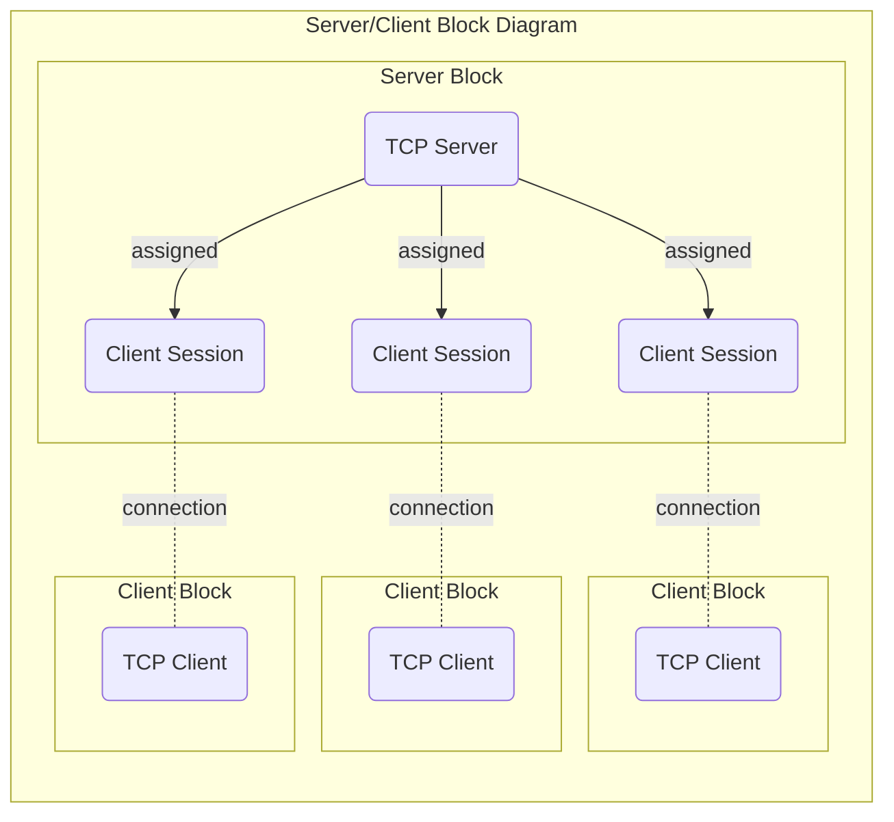
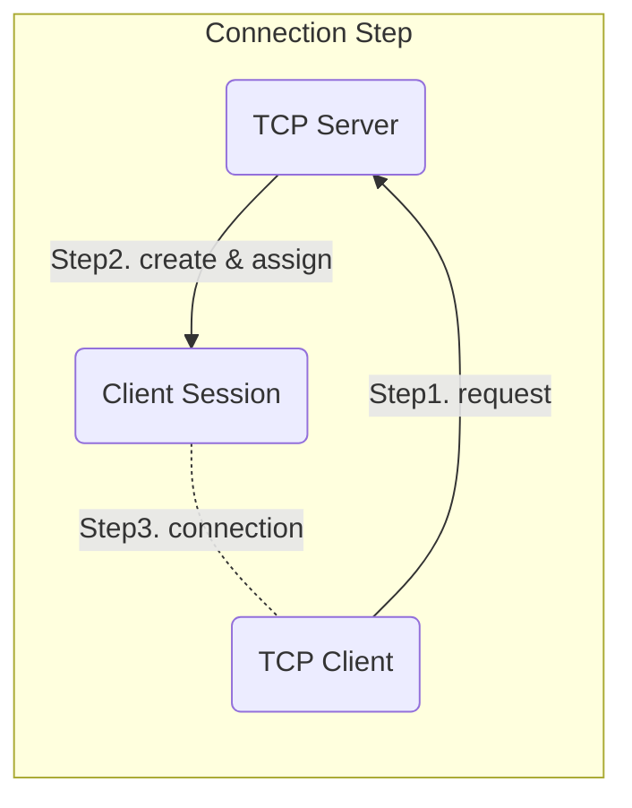
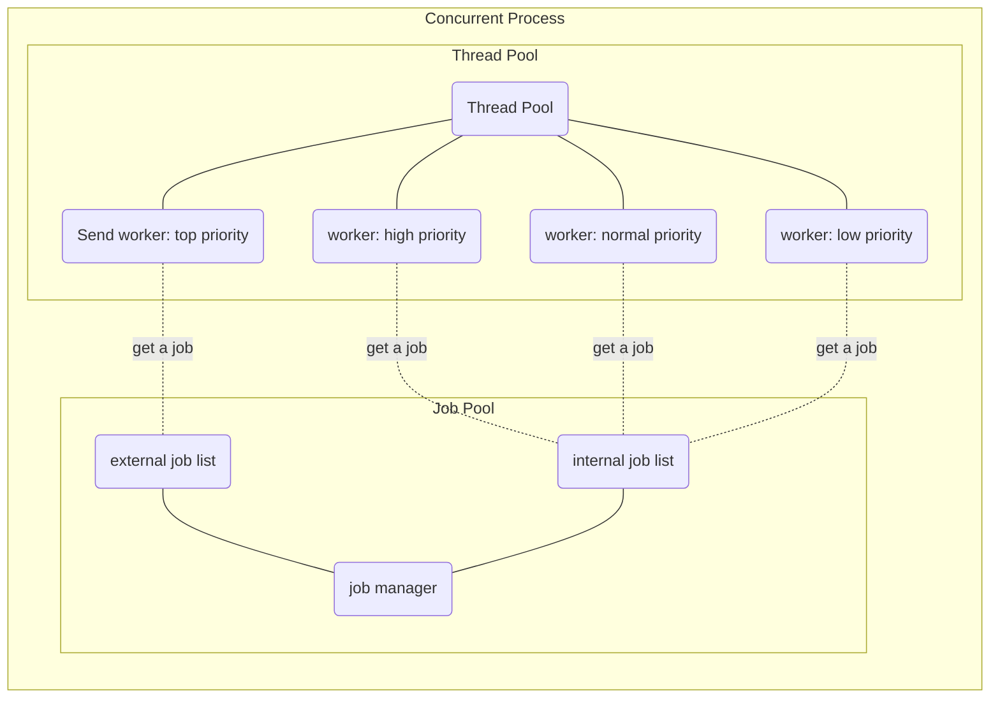

## What is?
Normally, it is pretty hard to implement a TCP server and client with a proper thread system in the C++ language. To support newbie's desire to make their own TCP communication system, I planned its project.

So, it will contain several systems like below,
1. File log system
2. Concurrency control by the thread pool system
3. Serializable data packet container
4. Asynchronous multi-session TCP server
5. Asynchronous TCP Client

And, it will provide functions like below,
1. Callback functions for each sequence such as connection, receiving data and receiving file
2. Send packet to specific target client
3. Send packet to all connected clients
4. Send files between main server and middle server
5. Packet compress and encrypt

## How to build
Before building this project, you have to download and build [vcpkg](https://github.com/Microsoft/vcpkg).
Secondly, should install libraries like below followed vcpkg install rule,

1. [asio library](https://github.com/chriskohlhoff/asio/): to support network implement
2. [fmt library](https://github.com/fmtlib/fmt): to support string formatting
3. [cryptopp library](https://www.cryptopp.com/): to support data encryption
4. [lz4 library](https://github.com/lz4/lz4): to support data compression
5. [crossguid library](https://github.com/graeme-hill/crossguid): to support creating guid
6. [cpprestsdk library](https://github.com/microsoft/cpprestsdk): to support RESTAPI server & client

After all installations, you can build this project on Linux, OSX and Windows

## How to use

To understand how to use this library, it provided several sample programs on the samples folder.

1. [logging_sample](https://github.com/kcenon/samples/tree/main/logging_sample): implemented how to use logging
2. [compression_sample](https://github.com/kcenon/samples/tree/main/compression_sample): implemented how to use compression
3. [decompression_sample](https://github.com/kcenon/samples/tree/main/decompression_sample): implemented how to use decompression
4. [container_sample](https://github.com/kcenon/samples/tree/main/container_sample): implemented how to use data container
5. [threads_sample](https://github.com/kcenon/samples/tree/main/threads_sample): implemented how to use priority thread with job or callback function
6. [echo_server](https://github.com/kcenon/samples/tree/main/echo_server): implemented how to use network library for creating an echo server
7. [echo_client](https://github.com/kcenon/samples/tree/main/echo_client): implemented how to use network library for creating an echo client
8. [download_sample](https://github.com/kcenon/file_manager/tree/main/download_sample): implemented how to use file download via provided micro-server on the micro-services folder
9. [upload_sample](https://github.com/kcenon/file_manager/tree/main/upload_sample): implemented how to use file upload via provided micro-server on the micro-services folder
10. [restapi_client_sample](https://github.com/kcenon/file_manager/tree/main/restapi_client_sample): implemented how to use restapi via provided micro-server on the micro-services folder

## Architecture

#### Server/Client structure

  
#### connection process
  

#### Currency process

## Contact
Please report issues or questions here: https://github.com/kcenon/messaging_system/issues
s