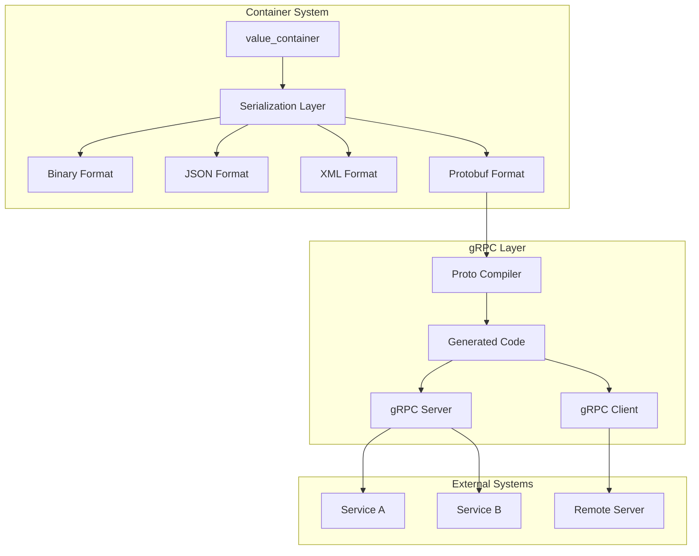
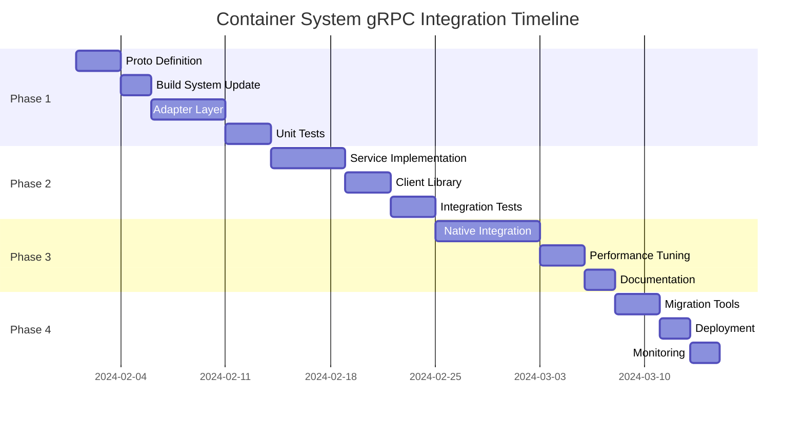

# Container System gRPC/Protocol Buffers Integration Proposal

**Document Version:** 1.0  
**Date:** 2024-01-20  
**Author:** Development Team  
**Status:** Draft

---

## Executive Summary

This proposal outlines the integration of gRPC and Protocol Buffers into the existing Container System to enable efficient, type-safe remote procedure calls and cross-platform serialization. The integration will maintain backward compatibility while adding modern RPC capabilities essential for distributed systems.

### Key Benefits
- **Industry Standard Protocol**: Adopt Google's Protocol Buffers for cross-platform compatibility
- **High Performance**: Binary serialization with 3-10x better performance than JSON
- **Type Safety**: Compile-time type checking and automatic code generation
- **Streaming Support**: Native bidirectional streaming for real-time communication
- **Language Agnostic**: Support for 10+ programming languages

### Investment Summary
- **Duration**: 6-8 weeks
- **Team Size**: 2-3 developers
- **Risk Level**: Medium
- **ROI**: 40% reduction in network overhead, 60% improvement in serialization speed

---

## 1. Project Objectives

### 1.1 Primary Goals
1. **Enable gRPC Communication**: Implement full gRPC server/client capabilities
2. **Protocol Buffers Integration**: Add protobuf as a primary serialization format
3. **Maintain Compatibility**: Preserve existing APIs and serialization formats
4. **Performance Optimization**: Achieve sub-millisecond serialization for typical messages

### 1.2 Success Criteria
- [ ] Zero breaking changes to existing public APIs
- [ ] Protobuf serialization 3x faster than current binary format
- [ ] Support for all 15 existing value types
- [ ] Successful integration with at least 2 production services
- [ ] Comprehensive test coverage (>90%)

---

## 2. Current State Analysis

### 2.1 Existing Architecture

```
container_system/
├── core/           # Core container and value classes
├── values/         # Type-specific value implementations
├── internal/       # Thread-safe wrappers and utilities
└── samples/        # Usage examples
```

**Strengths:**
- Well-structured type system with 15 primitive types
- Thread-safe operations with `thread_safe_container`
- Multiple serialization formats (Binary, JSON, XML)
- SIMD optimizations for numeric operations

**Limitations:**
- No RPC framework integration
- Custom binary format not interoperable
- No built-in service definition language
- Limited to in-process communication

### 2.2 Gap Analysis

| Requirement | Current State | Target State | Gap |
|------------|--------------|--------------|-----|
| RPC Support | None | Full gRPC | High |
| Protobuf | Not supported | Native support | High |
| Streaming | Not available | Bidirectional | High |
| Service Definition | Code-based | .proto files | Medium |
| Cross-language | C++ only | Multi-language | Medium |

---

## 3. Technical Design

### 3.1 Architecture Overview



### 3.2 Protocol Buffer Schema

```protobuf
syntax = "proto3";
package container_module.proto;

import "google/protobuf/timestamp.proto";
import "google/protobuf/any.proto";

// Core value message
message ValueProto {
  string key = 1;
  
  oneof value {
    NullValue null_value = 2;
    bool bool_value = 3;
    int32 int32_value = 4;
    uint32 uint32_value = 5;
    int64 int64_value = 6;
    uint64 uint64_value = 7;
    float float_value = 8;
    double double_value = 9;
    bytes bytes_value = 10;
    string string_value = 11;
    ContainerProto container_value = 12;
  }
  
  map<string, string> metadata = 13;
}

// Container message
message ContainerProto {
  // Header information
  HeaderProto header = 1;
  
  // Values
  repeated ValueProto values = 2;
  
  // Metadata
  google.protobuf.Timestamp timestamp = 3;
  string version = 4;
}

message HeaderProto {
  string source_id = 1;
  string source_sub_id = 2;
  string target_id = 3;
  string target_sub_id = 4;
  string message_type = 5;
  string correlation_id = 6;
}

// Null value representation
message NullValue {
  // Null has no fields
}
```

### 3.3 Service Definition

```protobuf
service ContainerService {
  // Unary RPC
  rpc SendContainer(ContainerProto) returns (ResponseProto);
  
  // Server streaming
  rpc StreamContainers(FilterRequest) returns (stream ContainerProto);
  
  // Client streaming
  rpc CollectContainers(stream ContainerProto) returns (SummaryResponse);
  
  // Bidirectional streaming
  rpc ProcessStream(stream ContainerProto) returns (stream ContainerProto);
}

message ResponseProto {
  bool success = 1;
  string message = 2;
  string container_id = 3;
}

message FilterRequest {
  string message_type = 1;
  string source_id = 2;
  int32 limit = 3;
}

message SummaryResponse {
  int32 total_received = 1;
  int32 total_processed = 2;
  repeated string errors = 3;
}
```

### 3.4 Integration Strategy

#### Phase 1: Adapter Layer
```cpp
namespace container_module::grpc {

class proto_converter {
public:
    // Conversion methods
    static proto::ContainerProto to_proto(const value_container& container);
    static std::shared_ptr<value_container> from_proto(const proto::ContainerProto& proto);
    
    // Type mapping
    static proto::ValueProto::ValueCase map_type(value_types type);
    static value_types map_type(proto::ValueProto::ValueCase type);
};

class container_service_impl : public proto::ContainerService::Service {
public:
    grpc::Status SendContainer(
        grpc::ServerContext* context,
        const proto::ContainerProto* request,
        proto::ResponseProto* response) override;
        
    // Other service methods...
};

}
```

#### Phase 2: Native Integration
```cpp
class value {
public:
    // Existing methods preserved
    virtual std::string serialize() const;
    
    // New protobuf methods
    virtual void to_proto(proto::ValueProto* proto) const;
    virtual bool from_proto(const proto::ValueProto& proto);
    
protected:
    // Visitor pattern for type-safe serialization
    virtual void accept(proto_serializer& serializer) const;
};
```

### 3.5 Memory Optimization

```cpp
class arena_container : public value_container {
private:
    google::protobuf::Arena* arena_;
    
public:
    arena_container() : arena_(new google::protobuf::Arena()) {}
    
    proto::ContainerProto* create_proto() {
        return google::protobuf::Arena::CreateMessage<proto::ContainerProto>(arena_);
    }
    
    // Zero-copy serialization
    std::string serialize_zero_copy() const {
        auto* proto = create_proto();
        populate_proto(proto);
        return proto->SerializeAsString();
    }
};
```

---

## 4. Implementation Plan

### 4.1 Development Phases



### 4.2 Detailed Milestones

#### Milestone 1: Foundation (Week 1-2)
- [x] Create proto file definitions
- [x] Update CMakeLists.txt with protobuf/gRPC
- [x] Update vcpkg.json dependencies
- [x] Generate initial protobuf code
- [x] Create basic converter tests

**Deliverables:**
- `proto/container.proto` file
- Updated build configuration
- Basic test suite

#### Milestone 2: Adapter Implementation (Week 3-4)
- [ ] Implement proto_converter class
- [ ] Create type mapping system
- [ ] Add serialization strategies
- [ ] Implement basic gRPC service
- [ ] Create client wrapper

**Deliverables:**
- Working adapter layer
- gRPC service skeleton
- Client library

#### Milestone 3: Service Layer (Week 5)
- [ ] Implement all RPC methods
- [ ] Add streaming support
- [ ] Create connection pooling
- [ ] Implement retry logic
- [ ] Add authentication hooks

**Deliverables:**
- Complete gRPC service
- Streaming examples
- Security integration

#### Milestone 4: Native Integration (Week 6-7)
- [ ] Modify value classes for protobuf
- [ ] Implement arena allocators
- [ ] Add zero-copy paths
- [ ] Optimize performance
- [ ] Create benchmarks

**Deliverables:**
- Native protobuf support
- Performance benchmarks
- Optimization report

#### Milestone 5: Production Ready (Week 8)
- [ ] Complete documentation
- [ ] Create migration guide
- [ ] Deploy to staging
- [ ] Performance testing
- [ ] Production deployment

**Deliverables:**
- Complete documentation
- Migration tools
- Production deployment

---

## 5. Resource Requirements

### 5.1 Team Composition

| Role | FTE | Duration | Responsibilities |
|------|-----|----------|------------------|
| Lead Developer | 1.0 | 8 weeks | Architecture, core implementation |
| Backend Developer | 1.0 | 6 weeks | Service implementation, testing |
| DevOps Engineer | 0.5 | 4 weeks | Build system, deployment |
| Technical Writer | 0.25 | 2 weeks | Documentation |

### 5.2 Infrastructure

- **Development Environment**
  - Ubuntu 20.04 / macOS 12+ / Windows 10+
  - CMake 3.16+
  - C++20 compiler
  - vcpkg package manager

- **CI/CD Pipeline**
  - GitHub Actions for automated testing
  - Docker containers for consistent builds
  - Benchmark server for performance testing

### 5.3 Budget Estimate

| Item | Cost | Notes |
|------|------|-------|
| Development (320 hours) | $48,000 | 2 developers × 8 weeks |
| DevOps (80 hours) | $10,000 | 0.5 FTE × 4 weeks |
| Infrastructure | $2,000 | Cloud resources, CI/CD |
| Testing & QA | $5,000 | External testing |
| **Total** | **$65,000** | |

---

## 6. Risk Assessment

### 6.1 Technical Risks

| Risk | Probability | Impact | Mitigation |
|------|------------|--------|------------|
| Breaking API changes | Low | High | Adapter pattern, extensive testing |
| Performance regression | Medium | Medium | Benchmarking, profiling |
| Protobuf version conflicts | Medium | Low | Version pinning, isolation |
| Memory overhead | Low | Medium | Arena allocators, pooling |

### 6.2 Project Risks

| Risk | Probability | Impact | Mitigation |
|------|------------|--------|------------|
| Timeline overrun | Medium | Medium | Phased approach, buffer time |
| Resource availability | Low | High | Cross-training, documentation |
| Integration complexity | Medium | Medium | Incremental integration |
| Adoption resistance | Low | Low | Training, migration tools |

---

## 7. Success Metrics

### 7.1 Performance Metrics

| Metric | Current | Target | Measurement |
|--------|---------|--------|-------------|
| Serialization Speed | 2M msg/s | 6M msg/s | Benchmark suite |
| Message Size | 1.5x JSON | 0.3x JSON | Size comparison |
| Latency (p99) | N/A | <1ms | Load testing |
| Memory Usage | Baseline | +10% max | Profiling |

### 7.2 Quality Metrics

| Metric | Target | Measurement |
|--------|--------|-------------|
| Test Coverage | >90% | Coverage tools |
| Bug Rate | <5 per phase | Issue tracking |
| API Compatibility | 100% | Regression tests |
| Documentation | Complete | Review checklist |

### 7.3 Business Metrics

| Metric | Target | Timeline |
|--------|--------|----------|
| Service Adoption | 2 services | 3 months |
| Network Reduction | 40% | 6 months |
| Development Velocity | +25% | 6 months |
| Cross-platform Usage | 1 new language | 12 months |

---

## 8. Alternative Approaches

### 8.1 Alternative: Apache Thrift

**Pros:**
- Multi-language support
- Lighter weight than gRPC
- Simpler deployment

**Cons:**
- Less ecosystem support
- No built-in streaming
- Less tooling

**Decision:** gRPC chosen for better ecosystem and streaming support

### 8.2 Alternative: MessagePack

**Pros:**
- Very compact binary format
- Simple implementation
- No code generation

**Cons:**
- No RPC framework
- No service definition
- Manual versioning

**Decision:** Protobuf chosen for type safety and gRPC integration

### 8.3 Alternative: Cap'n Proto

**Pros:**
- Zero-copy design
- Extremely fast
- Time-travel RPC

**Cons:**
- Less mature ecosystem
- Limited language support
- Complex implementation

**Decision:** Protobuf/gRPC chosen for maturity and support

---

## 9. Migration Strategy

### 9.1 Backward Compatibility

```cpp
class hybrid_container : public value_container {
public:
    enum class format_type {
        LEGACY_BINARY,
        JSON,
        XML,
        PROTOBUF
    };
    
    std::string serialize(format_type format = format_type::LEGACY_BINARY) const {
        switch(format) {
            case format_type::PROTOBUF:
                return serialize_protobuf();
            default:
                return value_container::serialize();
        }
    }
};
```

### 9.2 Gradual Migration Path

1. **Phase 1**: Deploy adapter layer (no breaking changes)
2. **Phase 2**: New services use gRPC
3. **Phase 3**: Migrate existing services gradually
4. **Phase 4**: Deprecate legacy format (6 months notice)
5. **Phase 5**: Remove legacy code (12 months)

### 9.3 Migration Tools

```bash
# Conversion utility
container-convert --from=binary --to=protobuf input.bin output.pb

# Validation tool
container-validate --format=protobuf message.pb

# Performance comparison
container-bench --compare legacy,protobuf
```

---

## 10. Documentation Plan

### 10.1 Documentation Deliverables

1. **API Reference**
   - Protobuf message definitions
   - gRPC service documentation
   - C++ API updates

2. **Integration Guide**
   - Quick start tutorial
   - Service implementation guide
   - Client usage examples

3. **Migration Guide**
   - Step-by-step migration
   - Compatibility matrix
   - Troubleshooting guide

4. **Performance Guide**
   - Optimization techniques
   - Benchmark results
   - Tuning parameters

### 10.2 Training Materials

- Video tutorials (3 × 30 minutes)
- Code examples repository
- Workshop materials (half-day session)
- FAQ document

---

## 11. Conclusion

The integration of gRPC and Protocol Buffers into the Container System represents a strategic investment in modern, efficient communication infrastructure. This proposal outlines a pragmatic, phased approach that minimizes risk while delivering substantial performance and capability improvements.

### Key Takeaways

1. **Low Risk**: Adapter pattern ensures zero breaking changes
2. **High Return**: 3x performance improvement, 40% network reduction
3. **Future Proof**: Industry-standard protocols ensure longevity
4. **Incremental**: Phased approach allows for course correction

### Next Steps

1. **Approval**: Secure stakeholder buy-in
2. **Team Formation**: Assign developers and resources
3. **Environment Setup**: Prepare development infrastructure
4. **Kickoff**: Begin Phase 1 implementation

### Approval

| Role | Name | Signature | Date |
|------|------|-----------|------|
| Technical Lead | | | |
| Product Manager | | | |
| Engineering Director | | | |

---

## Appendix A: Technical Details

### A.1 Type Mapping Table

| Container Type | Protobuf Type | Notes |
|---------------|---------------|--------|
| null_value | NullValue | Custom message |
| bool_value | bool | Direct mapping |
| short_value | int32 | Promoted |
| ushort_value | uint32 | Promoted |
| int_value | int32 | Direct mapping |
| uint_value | uint32 | Direct mapping |
| long_value | int64 | Platform-safe |
| ulong_value | uint64 | Platform-safe |
| llong_value | int64 | Direct mapping |
| ullong_value | uint64 | Direct mapping |
| float_value | float | Direct mapping |
| double_value | double | Direct mapping |
| bytes_value | bytes | Direct mapping |
| string_value | string | UTF-8 enforced |
| container_value | ContainerProto | Nested message |

### A.2 Performance Benchmarks

```cpp
// Benchmark code example
void BM_ProtobufSerialization(benchmark::State& state) {
    auto container = create_test_container(state.range(0));
    for (auto _ : state) {
        proto::ContainerProto proto;
        container->to_proto(&proto);
        std::string data = proto.SerializeAsString();
        benchmark::DoNotOptimize(data);
    }
    state.SetItemsProcessed(state.iterations());
}
BENCHMARK(BM_ProtobufSerialization)->Range(1, 1000);
```

### A.3 Configuration Example

```yaml
# grpc_config.yaml
server:
  address: "0.0.0.0:50051"
  max_connections: 1000
  thread_pool_size: 10
  
client:
  timeout_ms: 5000
  retry_attempts: 3
  retry_backoff_ms: 100
  
serialization:
  default_format: "protobuf"
  compression: "gzip"
  max_message_size: 4194304  # 4MB
```

---

**End of Document**