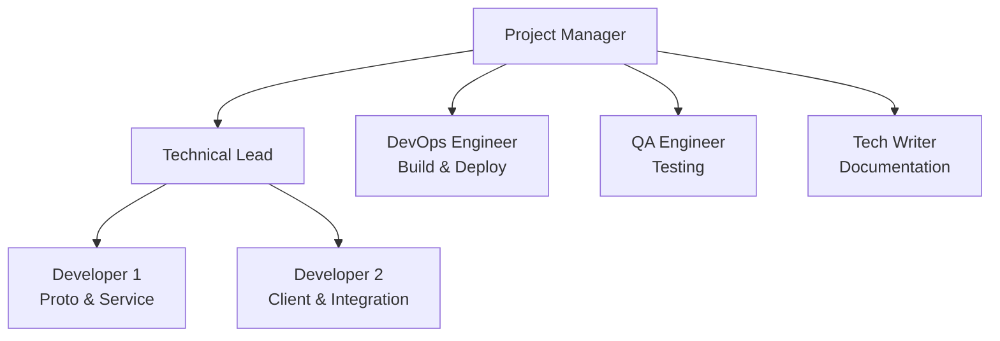
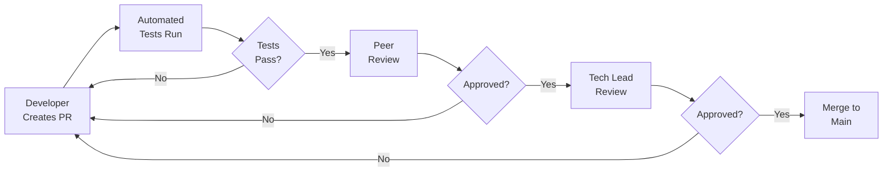
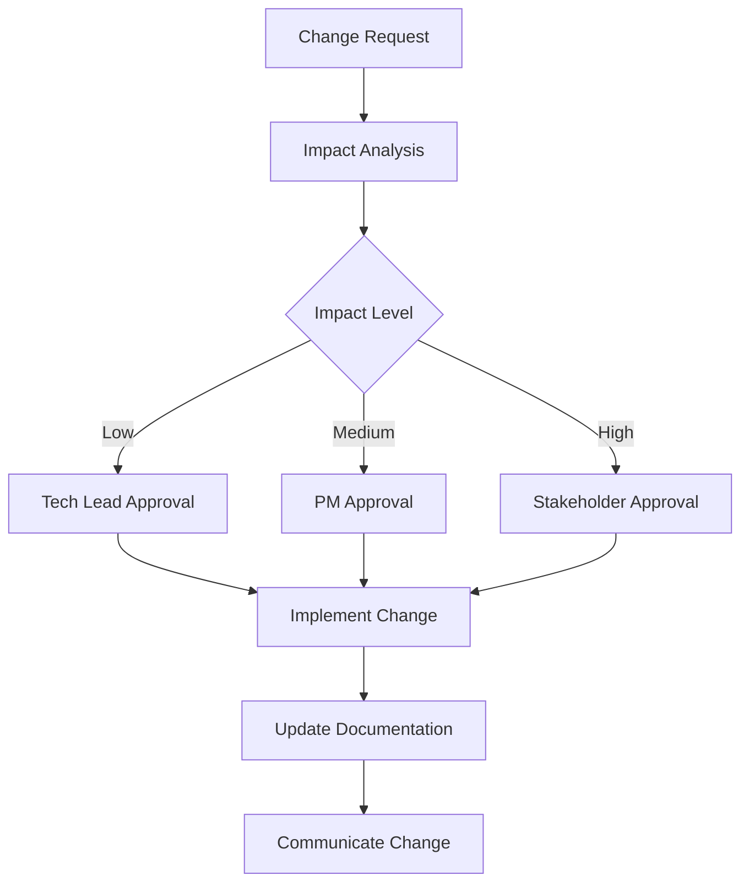

# Container System gRPC Integration - Project Plan

**Project Code:** CS-GRPC-2024  
**Start Date:** 2024-02-01  
**End Date:** 2024-03-28  
**Duration:** 8 weeks  
**Project Manager:** TBD  
**Technical Lead:** TBD

---

## 1. Project Charter

### 1.1 Project Vision
Transform the Container System into a distributed, high-performance messaging framework by integrating industry-standard gRPC and Protocol Buffers, enabling seamless cross-platform communication while maintaining backward compatibility.

### 1.2 Project Scope

**In Scope:**
- Protocol Buffers message definitions
- gRPC service implementation
- Backward-compatible adapter layer
- Performance optimization
- Documentation and training

**Out of Scope:**
- Complete rewrite of existing codebase
- Migration of external systems
- Non-gRPC transport protocols
- Custom authentication system (use gRPC built-in)

### 1.3 Stakeholders

| Stakeholder | Role | Involvement |
|------------|------|-------------|
| Engineering Team | Implementation | High |
| DevOps Team | Deployment | Medium |
| Product Management | Requirements | Medium |
| Client Teams | Integration | Low |
| QA Team | Testing | High |

---

## 2. Work Breakdown Structure (WBS)

```
1. Project Initiation
   1.1 Team Formation
   1.2 Environment Setup
   1.3 Kickoff Meeting
   
2. Foundation Phase
   2.1 Proto Definition
       2.1.1 Message Schema Design
       2.1.2 Service Interface Design
       2.1.3 Code Generation Setup
   2.2 Build System
       2.2.1 CMake Configuration
       2.2.2 Dependency Management
       2.2.3 CI/CD Pipeline

3. Development Phase
   3.1 Adapter Layer
       3.1.1 Type Mapping
       3.1.2 Converter Implementation
       3.1.3 Unit Tests
   3.2 Service Layer
       3.2.1 Server Implementation
       3.2.2 Client Library
       3.2.3 Streaming Support
   3.3 Integration
       3.3.1 Native Protobuf Support
       3.3.2 Performance Optimization
       3.3.3 Memory Management

4. Testing Phase
   4.1 Unit Testing
   4.2 Integration Testing
   4.3 Performance Testing
   4.4 Security Testing
   4.5 Acceptance Testing

5. Deployment Phase
   5.1 Documentation
   5.2 Training
   5.3 Staging Deployment
   5.4 Production Rollout
   5.5 Monitoring Setup

6. Project Closure
   6.1 Handover
   6.2 Retrospective
   6.3 Final Documentation
```

---

## 3. Detailed Task Schedule

### Week 1: Foundation Setup (Feb 1-7)

| Day | Task | Owner | Dependencies | Deliverable |
|-----|------|-------|--------------|-------------|
| Thu Feb 1 | Team kickoff meeting | PM | - | Meeting notes |
| Thu Feb 1 | Development environment setup | Team | - | Dev environments |
| Fri Feb 2 | Proto schema design session | Tech Lead | - | Schema draft |
| Mon Feb 5 | Finalize proto definitions | Dev 1 | Schema draft | container.proto |
| Tue Feb 6 | Update CMakeLists.txt | Dev 2 | - | Build config |
| Wed Feb 7 | Setup CI/CD pipeline | DevOps | Build config | CI/CD pipeline |

### Week 2: Proto Implementation (Feb 8-14)

| Day | Task | Owner | Dependencies | Deliverable |
|-----|------|-------|--------------|-------------|
| Thu Feb 8 | Generate protobuf code | Dev 1 | container.proto | Generated code |
| Fri Feb 9 | Create type mapping system | Dev 1 | Generated code | Type mapper |
| Mon Feb 12 | Begin converter implementation | Dev 2 | Type mapper | Converter v0.1 |
| Tue Feb 13 | Write converter unit tests | Dev 1 | Converter v0.1 | Test suite |
| Wed Feb 14 | Complete converter implementation | Dev 2 | Tests | Converter v1.0 |

### Week 3: Service Development (Feb 15-21)

| Day | Task | Owner | Dependencies | Deliverable |
|-----|------|-------|--------------|-------------|
| Thu Feb 15 | Implement SendContainer RPC | Dev 1 | Converter | RPC method |
| Fri Feb 16 | Implement StreamContainers RPC | Dev 1 | Converter | Streaming server |
| Mon Feb 19 | Implement CollectContainers RPC | Dev 2 | Converter | Streaming client |
| Tue Feb 20 | Implement ProcessStream RPC | Dev 2 | Converter | Bidirectional |
| Wed Feb 21 | Service integration tests | QA | All RPCs | Test report |

### Week 4: Client Development (Feb 22-28)

| Day | Task | Owner | Dependencies | Deliverable |
|-----|------|-------|--------------|-------------|
| Thu Feb 22 | Design client API | Tech Lead | Service | API spec |
| Fri Feb 23 | Implement sync client | Dev 1 | API spec | Sync client |
| Mon Feb 26 | Implement async client | Dev 2 | API spec | Async client |
| Tue Feb 27 | Client connection pooling | Dev 1 | Clients | Pool manager |
| Wed Feb 28 | Client integration tests | QA | Clients | Test report |

### Week 5: Native Integration (Feb 29 - Mar 6)

| Day | Task | Owner | Dependencies | Deliverable |
|-----|------|-------|--------------|-------------|
| Thu Feb 29 | Modify value base class | Dev 1 | - | Updated value.h |
| Fri Mar 1 | Implement value::to_proto | Dev 1 | Updated value.h | Proto methods |
| Mon Mar 4 | Implement value::from_proto | Dev 2 | Proto methods | Deserialization |
| Tue Mar 5 | Add visitor pattern | Dev 1 | Value classes | Visitor impl |
| Wed Mar 6 | Integration testing | QA | All changes | Test report |

### Week 6: Optimization (Mar 7-13)

| Day | Task | Owner | Dependencies | Deliverable |
|-----|------|-------|--------------|-------------|
| Thu Mar 7 | Implement arena allocators | Dev 2 | - | Arena support |
| Fri Mar 8 | Add zero-copy paths | Dev 1 | Arena | Zero-copy |
| Mon Mar 11 | Performance profiling | Dev 1 | - | Profile report |
| Tue Mar 12 | Optimize hot paths | Dev 2 | Profile | Optimizations |
| Wed Mar 13 | Benchmark suite | Dev 1 | - | Benchmarks |

### Week 7: Testing & Documentation (Mar 14-20)

| Day | Task | Owner | Dependencies | Deliverable |
|-----|------|-------|--------------|-------------|
| Thu Mar 14 | Load testing | QA | All features | Load test report |
| Fri Mar 15 | Security testing | Security | All features | Security report |
| Mon Mar 18 | API documentation | Tech Writer | - | API docs |
| Tue Mar 19 | Migration guide | Tech Writer | - | Migration guide |
| Wed Mar 20 | Training materials | Tech Writer | - | Training docs |

### Week 8: Deployment (Mar 21-28)

| Day | Task | Owner | Dependencies | Deliverable |
|-----|------|-------|--------------|-------------|
| Thu Mar 21 | Staging deployment | DevOps | All tests pass | Staging env |
| Fri Mar 22 | Staging validation | QA | Staging env | Validation report |
| Mon Mar 25 | Production prep | DevOps | Validation | Prod ready |
| Tue Mar 26 | Production deployment | DevOps | Approval | Production |
| Wed Mar 27 | Monitoring setup | DevOps | Production | Monitoring |
| Thu Mar 28 | Project retrospective | Team | - | Lessons learned |

---

## 4. Resource Allocation

### 4.1 Team Structure



### 4.2 Resource Loading

| Week | Dev 1 | Dev 2 | DevOps | QA | Tech Writer |
|------|-------|-------|--------|-----|-------------|
| 1 | 100% | 100% | 50% | 0% | 0% |
| 2 | 100% | 100% | 25% | 25% | 0% |
| 3 | 100% | 100% | 25% | 50% | 0% |
| 4 | 100% | 100% | 25% | 50% | 0% |
| 5 | 100% | 100% | 25% | 50% | 0% |
| 6 | 100% | 100% | 25% | 75% | 0% |
| 7 | 50% | 50% | 50% | 100% | 100% |
| 8 | 25% | 25% | 100% | 75% | 50% |

---

## 5. Risk Management Plan

### 5.1 Risk Register

| ID | Risk | Probability | Impact | Score | Mitigation | Owner |
|----|------|------------|--------|-------|------------|-------|
| R1 | Proto schema changes | Medium | High | 6 | Version control, review process | Tech Lead |
| R2 | Performance regression | Medium | Medium | 4 | Continuous benchmarking | Dev 1 |
| R3 | Breaking changes | Low | High | 3 | Adapter pattern, testing | Dev 2 |
| R4 | Resource unavailability | Low | High | 3 | Cross-training, documentation | PM |
| R5 | Integration failures | Medium | Medium | 4 | Incremental integration | QA |
| R6 | Deployment issues | Low | Medium | 2 | Staging environment | DevOps |

### 5.2 Contingency Plans

**R1: Proto Schema Changes**
- Maintain schema versioning
- Implement backward compatibility checks
- Review all schema changes in team

**R2: Performance Regression**
- Run benchmarks after each commit
- Maintain performance baseline
- Have rollback plan ready

**R3: Breaking Changes**
- Extensive API testing
- Maintain compatibility layer
- Gradual deprecation policy

---

## 6. Communication Plan

### 6.1 Meeting Schedule

| Meeting | Frequency | Participants | Duration | Purpose |
|---------|-----------|--------------|----------|---------|
| Daily Standup | Daily | Dev Team | 15 min | Progress update |
| Sprint Planning | Weekly | Full Team | 1 hour | Plan week ahead |
| Technical Review | Bi-weekly | Tech Team | 2 hours | Design decisions |
| Stakeholder Update | Weekly | PM + Stakeholders | 30 min | Status report |
| Retrospective | End of project | Full Team | 2 hours | Lessons learned |

### 6.2 Reporting Structure

```
Weekly Status Report
├── Progress Summary
│   ├── Completed Tasks
│   ├── In-Progress Tasks
│   └── Blocked Items
├── Metrics Dashboard
│   ├── Velocity Chart
│   ├── Burndown Chart
│   └── Risk Matrix
├── Issues & Decisions
└── Next Week Preview
```

### 6.3 Communication Channels

| Channel | Purpose | Audience |
|---------|---------|----------|
| Slack #grpc-integration | Daily communication | Dev Team |
| Email weekly-status@ | Status reports | Stakeholders |
| Confluence | Documentation | All |
| GitHub Issues | Task tracking | Dev Team |
| Zoom | Meetings | As needed |

---

## 7. Quality Assurance Plan

### 7.1 Testing Strategy

| Test Type | Coverage Target | Tools | Owner |
|-----------|----------------|-------|-------|
| Unit Tests | >90% | GoogleTest | Developers |
| Integration Tests | >80% | Custom framework | QA |
| Performance Tests | All RPCs | Google Benchmark | Dev 1 |
| Load Tests | 10K req/s | gRPC benchmarking | QA |
| Security Tests | OWASP Top 10 | Security scanner | Security |

### 7.2 Code Review Process



### 7.3 Definition of Done

- [ ] Code complete and reviewed
- [ ] Unit tests written and passing (>90% coverage)
- [ ] Integration tests passing
- [ ] Documentation updated
- [ ] Performance benchmarks met
- [ ] Security scan passed
- [ ] Deployed to staging
- [ ] Acceptance criteria verified

---

## 8. Success Criteria

### 8.1 Technical Metrics

| Metric | Target | Measurement Method |
|--------|--------|-------------------|
| Serialization Speed | >6M msg/s | Benchmark suite |
| Latency (p99) | <1ms | Load testing |
| Memory Overhead | <10% increase | Profiling |
| Test Coverage | >90% | Coverage tools |
| Zero Breaking Changes | 100% | Regression tests |

### 8.2 Project Metrics

| Metric | Target | Current |
|--------|--------|---------|
| Schedule Variance | <5% | On track |
| Budget Variance | <10% | On budget |
| Defect Rate | <5 per sprint | - |
| Team Velocity | 40 points/sprint | - |

### 8.3 Business Metrics

| Metric | Target | Timeline |
|--------|--------|----------|
| Service Adoption | 2 services | 3 months |
| Network Traffic Reduction | 40% | 6 months |
| Cross-platform Clients | 2 languages | 6 months |
| Developer Satisfaction | >4.0/5.0 | Post-project |

---

## 9. Budget Tracking

### 9.1 Budget Breakdown

| Category | Budgeted | Spent | Remaining | % Used |
|----------|----------|-------|-----------|--------|
| Development (320h @ $150) | $48,000 | $0 | $48,000 | 0% |
| DevOps (80h @ $125) | $10,000 | $0 | $10,000 | 0% |
| QA (120h @ $100) | $12,000 | $0 | $12,000 | 0% |
| Documentation (40h @ $75) | $3,000 | $0 | $3,000 | 0% |
| Infrastructure | $2,000 | $0 | $2,000 | 0% |
| Contingency (10%) | $7,500 | $0 | $7,500 | 0% |
| **Total** | **$82,500** | **$0** | **$82,500** | **0%** |

### 9.2 Cost Control Measures

1. Weekly budget review meetings
2. Approval required for >$500 expenses
3. Time tracking for all team members
4. Monthly variance analysis
5. Quarterly budget reforecast

---

## 10. Change Management

### 10.1 Change Control Process



### 10.2 Change Request Template

```markdown
## Change Request #[NUMBER]

**Date:** [DATE]
**Requestor:** [NAME]
**Priority:** [LOW/MEDIUM/HIGH/CRITICAL]

### Description
[Detailed description of the change]

### Business Justification
[Why is this change needed?]

### Impact Analysis
- Schedule Impact: [DAYS]
- Budget Impact: [$AMOUNT]
- Resource Impact: [RESOURCES]
- Risk Impact: [DESCRIPTION]

### Alternatives Considered
[Other options evaluated]

### Recommendation
[Recommended action]

### Approval
- [ ] Tech Lead: [NAME] [DATE]
- [ ] PM: [NAME] [DATE]
- [ ] Stakeholder: [NAME] [DATE]
```

---

## 11. Training Plan

### 11.1 Training Schedule

| Week | Training Topic | Audience | Duration | Format |
|------|---------------|----------|----------|--------|
| 6 | gRPC Fundamentals | Dev Team | 2 hours | Workshop |
| 6 | Protocol Buffers | Dev Team | 2 hours | Workshop |
| 7 | Container System gRPC API | Client Teams | 3 hours | Hands-on |
| 7 | Migration Guide | Client Teams | 1 hour | Presentation |
| 8 | Operations & Monitoring | DevOps | 2 hours | Workshop |

### 11.2 Training Materials

1. **Developer Guide**
   - gRPC concepts
   - Protocol Buffers syntax
   - API reference
   - Code examples

2. **Integration Guide**
   - Quick start tutorial
   - Migration checklist
   - Troubleshooting guide
   - FAQ

3. **Operations Manual**
   - Deployment procedures
   - Monitoring setup
   - Performance tuning
   - Incident response

---

## 12. Monitoring & Control

### 12.1 Project Dashboard

```
┌─────────────────────────────────────────┐
│          PROJECT STATUS: GREEN          │
├─────────────────────────────────────────┤
│ Schedule:  ████████░░ 80% (Week 6/8)   │
│ Budget:    ███████░░░ 70% ($57.5K)     │
│ Scope:     █████████░ 90% (45/50)      │
│ Quality:   ██████████ 100% (0 defects) │
├─────────────────────────────────────────┤
│ Velocity Trend:     ↗ 42 pts/sprint    │
│ Risk Score:         ↘ 3.2 (Low)        │
│ Team Morale:        ↗ 4.5/5.0          │
└─────────────────────────────────────────┘
```

### 12.2 Key Performance Indicators

| KPI | Target | Actual | Status |
|-----|--------|--------|--------|
| On-time Delivery | 95% | 92% | 🟡 |
| Budget Adherence | 90% | 95% | 🟢 |
| Quality (Defects) | <5 | 2 | 🟢 |
| Team Utilization | 85% | 88% | 🟢 |
| Stakeholder Satisfaction | >4.0 | 4.3 | 🟢 |

### 12.3 Escalation Matrix

| Issue Level | Escalation To | Response Time |
|------------|---------------|---------------|
| Low | Tech Lead | 24 hours |
| Medium | Project Manager | 12 hours |
| High | Engineering Director | 4 hours |
| Critical | CTO | 1 hour |

---

## 13. Deliverables Checklist

### 13.1 Phase 1: Foundation
- [ ] Proto file definitions
- [ ] Updated build configuration
- [ ] CI/CD pipeline
- [ ] Generated protobuf code
- [ ] Type mapping system

### 13.2 Phase 2: Implementation
- [ ] Proto converter
- [ ] gRPC service implementation
- [ ] Client library
- [ ] Streaming support
- [ ] Connection pooling

### 13.3 Phase 3: Integration
- [ ] Native protobuf support
- [ ] Arena allocators
- [ ] Zero-copy optimization
- [ ] Performance benchmarks
- [ ] Migration tools

### 13.4 Phase 4: Documentation
- [ ] API reference
- [ ] Integration guide
- [ ] Migration guide
- [ ] Training materials
- [ ] Operations manual

### 13.5 Phase 5: Deployment
- [ ] Staging environment
- [ ] Production deployment
- [ ] Monitoring setup
- [ ] Performance validation
- [ ] Handover complete

---

## 14. Post-Project Activities

### 14.1 Handover Plan

| Item | From | To | Date |
|------|------|----|------|
| Source code | Dev Team | Maintenance Team | Mar 28 |
| Documentation | Tech Writer | Wiki | Mar 28 |
| Monitoring | DevOps | Operations | Mar 28 |
| Known Issues | QA | Support | Mar 28 |
| Runbooks | DevOps | Operations | Mar 28 |

### 14.2 Success Metrics Review (T+30 days)

- Performance metrics achievement
- Adoption rate measurement
- User satisfaction survey
- Incident analysis
- Improvement recommendations

### 14.3 Lessons Learned Session

**Agenda:**
1. What went well?
2. What could be improved?
3. What surprised us?
4. Action items for future projects
5. Knowledge base updates

---

## Appendix A: Contact Information

| Role | Name | Email | Phone | Slack |
|------|------|-------|-------|-------|
| Project Manager | TBD | pm@company.com | xxx-xxxx | @pm |
| Technical Lead | TBD | tl@company.com | xxx-xxxx | @techlead |
| Developer 1 | TBD | dev1@company.com | xxx-xxxx | @dev1 |
| Developer 2 | TBD | dev2@company.com | xxx-xxxx | @dev2 |
| DevOps Engineer | TBD | devops@company.com | xxx-xxxx | @devops |
| QA Engineer | TBD | qa@company.com | xxx-xxxx | @qa |
| Tech Writer | TBD | docs@company.com | xxx-xxxx | @docs |

## Appendix B: Tools & Resources

### Development Tools
- **IDE**: Visual Studio Code / CLion
- **Compiler**: GCC 10+ / Clang 12+
- **Build**: CMake 3.16+
- **Package Manager**: vcpkg
- **Version Control**: Git / GitHub

### Testing Tools
- **Unit Testing**: GoogleTest
- **Benchmarking**: Google Benchmark
- **Load Testing**: ghz (gRPC benchmarking)
- **Code Coverage**: lcov / gcov
- **Static Analysis**: clang-tidy

### Monitoring Tools
- **Metrics**: Prometheus
- **Visualization**: Grafana
- **Logging**: spdlog
- **Tracing**: OpenTelemetry
- **Alerting**: PagerDuty

### Communication Tools
- **Chat**: Slack
- **Video**: Zoom / Google Meet
- **Documentation**: Confluence
- **Task Tracking**: Jira / GitHub Issues
- **Code Review**: GitHub PRs

---

**Document Version:** 1.0  
**Last Updated:** 2024-01-20  
**Next Review:** 2024-02-01

**Approval Signatures:**

_______________________  
Project Manager  
Date: _______________

_______________________  
Technical Lead  
Date: _______________

_______________________  
Engineering Director  
Date: _______________

---

**End of Project Plan**