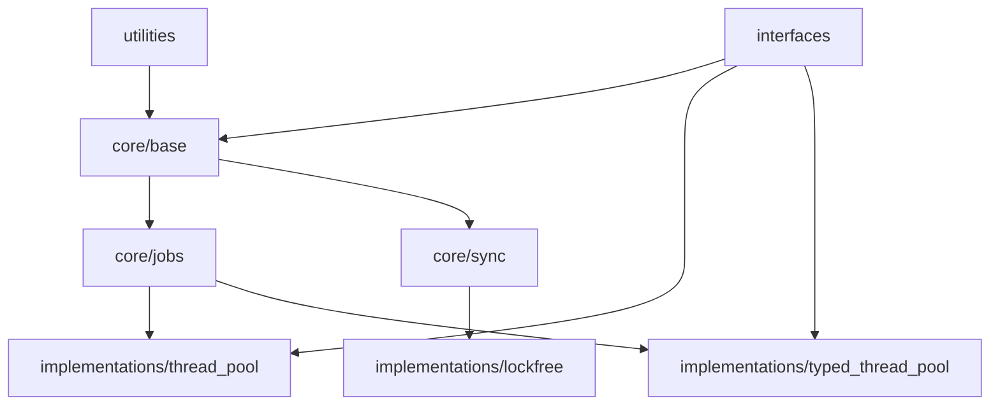

# Thread System — Design Improvement Plan

## Date
06 Sep 2025 (Asia/Seoul)

## Overview
This document presents a structured design improvement plan to address issues tracked in the project's issue tracker.

## 1. Architecture Improvements

### 1.1 Directory Structure Reorganization

#### Current Issues
- The `sources` and `modular_structure` directories are mixed
- The role of the `interfaces` directory is unclear
- Dependencies between modules are not explicit

#### Proposed Structure
```
thread_system/
├── core/                        # Core module
│   ├── base/                   # thread_base related
│   │   ├── include/
│   │   └── src/
│   ├── jobs/                   # job system
│   │   ├── include/
│   │   └── src/
│   └── sync/                   # synchronization primitives
│       ├── include/
│       └── src/
├── interfaces/                  # public interfaces
│   ├── logger_interface.h
│   ├── monitoring_interface.h
│   └── thread_context.h
├── implementations/             # concrete implementations
│   ├── thread_pool/
│   ├── typed_thread_pool/
│   └── lockfree/
├── utilities/                   # utilities
├── tests/                       # tests
├── benchmarks/                  # benchmarks
├── samples/                     # examples
└── docs/                        # documentation
```

### 1.2 Clarify Module Dependencies

#### Dependency Graph


#### Dependency Rules
1. Lower layers must not depend on higher layers
2. Circular dependencies are prohibited
3. Prefer dependency injection via interfaces

## 2. Interface Layer Reinforcement

### 2.1 New Interface Set

#### Core Interfaces
```cpp
namespace thread_system {
    // Executor interface
    class executor_interface {
    public:
        virtual ~executor_interface() = default;
        virtual auto execute(std::unique_ptr<job> work) -> result_void = 0;
        virtual auto shutdown() -> result_void = 0;
    };

    // Scheduler interface
    class scheduler_interface {
    public:
        virtual ~scheduler_interface() = default;
        virtual auto schedule(std::unique_ptr<job> work) -> result_void = 0;
        virtual auto get_next_job() -> std::unique_ptr<job> = 0;
    };

    // Monitorable component interface
    class monitorable_interface {
    public:
        virtual ~monitorable_interface() = default;
        virtual auto get_metrics() -> metrics_snapshot = 0;
        virtual auto reset_metrics() -> void = 0;
    };
}
```

### 2.2 Service Registry Pattern

#### Implementation Approach
```cpp
class service_registry {
private:
    static inline std::unordered_map<std::type_index, std::any> services_;
    static inline std::shared_mutex mutex_;

public:
    template<typename Interface>
    static auto register_service(std::shared_ptr<Interface> service) -> void {
        std::unique_lock lock(mutex_);
        services_[std::type_index(typeid(Interface))] = service;
    }

    template<typename Interface>
    static auto get_service() -> std::shared_ptr<Interface> {
        std::shared_lock lock(mutex_);
        auto it = services_.find(std::type_index(typeid(Interface)));
        if (it != services_.end()) {
            return std::any_cast<std::shared_ptr<Interface>>(it->second);
        }
        return nullptr;
    }
};
```

## 3. Documentation System Improvements

### 3.1 Automated Documentation Generation

#### Doxygen Integration
```cmake
# CMakeLists.txt additions
option(BUILD_DOCUMENTATION "Build documentation" ON)

if(BUILD_DOCUMENTATION)
    find_package(Doxygen REQUIRED)
    
    set(DOXYGEN_GENERATE_HTML YES)
    set(DOXYGEN_GENERATE_MAN NO)
    set(DOXYGEN_OUTPUT_DIRECTORY ${CMAKE_CURRENT_BINARY_DIR}/docs)
    set(DOXYGEN_EXTRACT_ALL YES)
    set(DOXYGEN_EXTRACT_PRIVATE YES)
    
    doxygen_add_docs(
        docs
        ${CMAKE_CURRENT_SOURCE_DIR}/sources
        COMMENT "Generating API documentation"
    )
endif()
```

### 3.2 Documentation Structure Standardization

#### Per-Module README Template
```markdown
# Module Name

## Overview
Describe the purpose of the module and its key features.

## Architecture
Internal structure of the module and design principles.

## API Reference
Describe the main classes and functions.

## Examples
Real usage code examples.

## Performance Characteristics
Benchmark results and optimization tips.

## Dependencies
Required modules and external libraries.
```

## 4. Testing and Quality Assurance

### 4.1 Coverage Targets

#### Coverage Criteria
- Code coverage: at least 80%
- Branch coverage: at least 70%
- Core module (core): 90% or higher

#### Test Automation
```cmake
# Coverage measurement
if(ENABLE_COVERAGE)
    set(CMAKE_CXX_FLAGS "${CMAKE_CXX_FLAGS} --coverage")
    set(CMAKE_EXE_LINKER_FLAGS "${CMAKE_EXE_LINKER_FLAGS} --coverage")
    
    add_custom_target(coverage
        COMMAND lcov --capture --directory . --output-file coverage.info
        COMMAND lcov --remove coverage.info '/usr/*' --output-file coverage.info
        COMMAND lcov --list coverage.info
        COMMAND genhtml coverage.info --output-directory coverage_report
        WORKING_DIRECTORY ${CMAKE_BINARY_DIR}
    )
endif()
```

### 4.2 Benchmark Automation

#### Benchmark Framework
```cpp
class benchmark_suite {
public:
    struct result {
        std::string name;
        double throughput;
        double latency_ns;
        double memory_mb;
    };

    template<typename Func>
    static auto run(const std::string& name, Func&& func, size_t iterations = 1000000) -> result {
        auto start = std::chrono::high_resolution_clock::now();
        
        for (size_t i = 0; i < iterations; ++i) {
            func();
        }
        
        auto end = std::chrono::high_resolution_clock::now();
        auto duration = std::chrono::duration_cast<std::chrono::nanoseconds>(end - start);
        
        return {
            .name = name,
            .throughput = static_cast<double>(iterations) / duration.count() * 1e9,
            .latency_ns = static_cast<double>(duration.count()) / iterations,
            .memory_mb = get_memory_usage_mb()
        };
    }
};
```

## 5. Build System Improvements

### 5.1 Modular CMake Configuration

#### Per-Module CMakeLists.txt
```cmake
# core/CMakeLists.txt
add_library(thread_system_core STATIC)

target_sources(thread_system_core
    PRIVATE
        base/src/thread_base.cpp
        jobs/src/job.cpp
        sync/src/sync_primitives.cpp
)

target_include_directories(thread_system_core
    PUBLIC
        $<BUILD_INTERFACE:${CMAKE_CURRENT_SOURCE_DIR}/base/include>
        $<BUILD_INTERFACE:${CMAKE_CURRENT_SOURCE_DIR}/jobs/include>
        $<BUILD_INTERFACE:${CMAKE_CURRENT_SOURCE_DIR}/sync/include>
        $<INSTALL_INTERFACE:include>
)

# Install rules
install(TARGETS thread_system_core
    EXPORT thread_system_targets
    LIBRARY DESTINATION lib
    ARCHIVE DESTINATION lib
    RUNTIME DESTINATION bin
)
```

### 5.2 Packaging

#### CMake Package File
```cmake
# ThreadSystemConfig.cmake.in
@PACKAGE_INIT@

include("${CMAKE_CURRENT_LIST_DIR}/ThreadSystemTargets.cmake")

check_required_components(ThreadSystem)

# Provided components
set(ThreadSystem_COMPONENTS
    Core
    ThreadPool
    TypedThreadPool
    Utilities
)
```

## 6. Coding Standards Unification

### 6.1 Naming Rules

#### Unified Rules
- Classes: `snake_case` (e.g., `thread_base`)
- Functions: `snake_case` (e.g., `get_worker_count`)
- Member variables: `snake_case_` (e.g., `worker_count_`)
- Template classes: `snake_case` (no suffix required)
- Interfaces: `snake_case_interface` (e.g., `logger_interface`)

### 6.2 Code Formatter Settings

#### .clang-format File
```yaml
BasedOnStyle: Google
IndentWidth: 4
TabWidth: 4
UseTab: Never
ColumnLimit: 100
PointerAlignment: Left
AlignAfterOpenBracket: Align
AllowShortFunctionsOnASingleLine: Empty
BreakConstructorInitializers: BeforeComma
```

## 7. Execution Plan

### Phase 1: Foundation (1 week)
1. Restructure directory layout
2. Improve CMake build system
3. Create base documentation templates

### Phase 2: Interface Improvements (2 weeks)
1. Define new interfaces
2. Implement service registry
3. Refactor existing code

### Phase 3: Documentation (1 week)
1. Integrate Doxygen
2. Write per-module READMEs
3. Generate API documentation

### Phase 4: Quality Assurance (2 weeks)
1. Establish coverage measurement system
2. Automate benchmarks
3. Improve CI/CD pipeline

### Phase 5: Finalization (1 week)
1. Code review and fixes
2. Final documentation review
3. Release preparation

## 8. Expected Benefits

1. **Maintainability**: Clear module structure and dependency management
2. **Scalability**: Interface-based design makes it easy to add new implementations
3. **Documentation Quality**: Automated generation and standardized templates
4. **Test Reliability**: Coverage measurement and automated testing
5. **Performance Transparency**: Automated benchmarks and continuous monitoring
6. **Developer Productivity**: Clear guidelines and tooling support

## 9. Risk Management

### Potential Risks
1. **API changes**: Compatibility issues with existing user code
   - Mitigation: Provide a migration guide; use deprecated markings
   
2. **Performance degradation**: Overhead from additional interfaces
   - Mitigation: Inline optimizations; leverage templates
   
3. **Increased build complexity**: Longer build times due to modularization
   - Mitigation: Precompiled headers; parallel build optimizations

## 10. Conclusion

This plan addresses structural issues in the thread_system project and provides a systematic approach to ensure long-term maintainability and extensibility. Through phased execution, we can minimize risk while improving overall quality.
